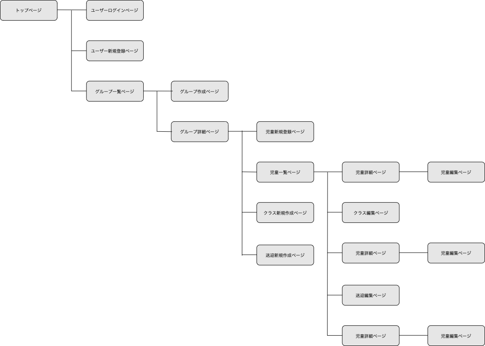

# アプリケーション名
Wasurena (勿忘）
 
 

# アプリケーション概要
幼稚園や保育園バスの送迎時に乗車と降車、出席、欠席の管理ができる。
 
 

# アプリケーションを作成した背景
保育園の送迎バスで子供を降ろし忘れ、亡くなってしまうニュースをを見ました。自分も幼稚園にバスで通う子供を持っています。そこで、ニュースのような子供を降ろし忘れるような事故が起きないようなアプリを作れないかと考え、作成を致しました。
 
 

# 工夫したポイント
- クラス詳細、送迎詳細ページ 
    ボタン動作部分をjavascriptで動かしているところです。 
    htmlだけで表示を作り、railsの表記に変えて、検証しながら書きました。 
    また、updateメソッドを２つ用意して、編集ページからのupdateを分けて実装しました。
- リセット機能 
    ヘッダーのユーザー名からプルダウンリストでリセットできるリンクを表示させています。 
    登園と降園時の送迎と日々の出席、欠席のリセットを想定して実装をしました。

# URL
- https://wasurena.onrender.com

# テスト用アカウント
- Basic認証ID: administrator

- Basic認証PASS:rrr9119

- テスト用アカウントID:test12345

- テスト用アカウントPASS:password12345

 
 

# 利用方法
## ユーザー登録
    
## グループの作成

## クラスの作成

## 送迎の作成

## 児童の登録

## 児童の編集

## 一覧ページでの動作
 
 

# 洗い出した要件
https://docs.google.com/spreadsheets/d/1FX-DNpxTTG3r5xCpaIUpdusAWN-7D5571AEyMTwJDoI/edit#gid=982722306
 
 

# 実装した機能についての画像、Gifおよびその説明
- クラス詳細ページでのボタンクリック時の表示

- 送迎詳細ページでのボタンクリック時の表示

 
 

# 実装予定の機能
- ユーザーを複数グループに所属できるようにする（実装完了）
- 管理者と編集者や一般として使用できることを権限毎に与える
- 児童詳細で、連絡事項などを忘れないようにメモできる機能（一部実装）
- 児童毎に設定するクラス、送迎種類をチェックボックスを使ってまとめて設定できるようにする
- 送迎の種類毎に時間を入れられるようにして児童をその順番に並べる機能
- レスポンシブデザイン対応（タブレットサイズ対応、スマホ対応未定）

# データベース設計

# 画面遷移図

# 開発環境
- フロントエンド：HTML,CSS,Javascript
- バックエンド：Ruby on Rails
- インフラ Render
- テスト Rspec
- テキストエディタ VScode
- タスク管理 GitHub
  
# ローカルでの動作方法
以下コマンド実行

% git clone https://github.com/rrr-ryu/wasurena.git

% cd wasureana

% bundle install

% yarn install

  